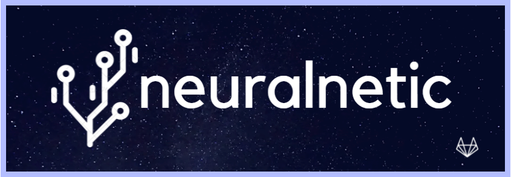

# Igrannonica Web App - Neuranetic

## Potrebni programi

> Angular: 13.2.5  
> Node: 16.14.0 
> Package Manager: 8.5.1 
> .Net: 6.0 
> MySql: 8.0 
> Python: 3.10 
> Python-library: sklearn,request,torch,pandas,numpy,signalrcore 
##
---
## FrontEnd

Potrebno je otvoriti cmd na src/frontend/angular 
Zatim je potrebno instalirati potrebne biblioteke sa:
> npm install
Ukoliko se ne instalira `@aspnet/signalr` potrebno je instalirati ga manuelno
> npm install @aspnet/signalr

Posle toga pokrenuti Angular server
>ng serve --open
---
## BackEnd

Potrebno je pokrenuti src/backend/dotNet.sln pomocu Visual Studio 2022
##
---
## Python

Potrebno je otvoriti cmd na src/ml 
Zatim je potrebno izvrsiti komandu
> py MLServer.py
##
---
## MySql

Potrebno je otvoriti Baza.sql unutar sql foldera i izvrsiti taj querty. 
Zatim je potrebno postaviti praznu sifru za root korisnika.
##

## Portovi
10061 -- Angular 
10062 -- dotNet 
10070 -- python 
##

## Pokretanje aplikacije 
Pre pokretanja apliacije potrebno je proveriti da li su portovi zauzeti i da li su procesi projekta vec pokretnuti. 
### Python
Potrebno je otvoriti folder NeuralNetic/Ml 
Zatim je potrebno izvrsiti komandu
> nohup python3 MLServer.py &
###
### BackEnd
Potrebno je otvoriti folder NeuralNetic/BackEnd 
Zatim je potrebno izvrsiti komandu
> nohup dotnet dotNet.dll &
###
### FrontEnd
Potrebno je otvoriti folder NeuralNetic/FrontEnd 
Zatim je potrebno izvrsiti komandu
> nohup python3 server.py &
###
##

## Uputstvo za pokretanje modela
1. Korisnik treba da napravi nalog, a zatim da se prijavi na njega
2. Potrebno je da korisnik napravi eksperiment, to moze da uradi klikom na dugme "Novi eksperiment", sto ce ga odvesti na stranu eksperimenta.
3. Potrebno je ucitati podatke (na crveno dugme) koji su u .csv formatu. Ukoliko postoje kategorijske vrednosti potrebno ih je enkodirati tako sto se izabere kolona i klikne se na dugme (Label encoding ili one-hot encoding). Moguce je rucno menjati podatke unutar tabele. SVE PROMENE SE NE CUVAJU U CSV FAJLU VEC JE SAMO IN-MEMORY!
4. Klikom na dugme izaberi ponudjene su opcije za testni skup. (Proveren nacin da radi je da se izabere Prozivoljan unos vrednosti, da se izabere neka vrednost(mora da se promeni na bilo koju, postoji bug!!!), a zatim kliknuti primeni da bi se ta vrednost primenila)
5. Potrebno je preci na tab modeli, napraviti model ako ne postoji ni jedan i otvoriti ga.
6. Potrebno je izabrati ulazne i izlazne kolone po zelji. Ostala podesavanja se cuvaju klikom da dugme sacuvaj. Pre pokretanja modela sva podesavanja se ponovo cuvaju.
7. Ukoliko su uradjeni svi koraci model je spreman za tesiranje. 
DUGME ZA POKRETANJE TRENIRANJA JE DOVOLJNO PRITISNUTI SAMO JEDNOM 
Ako je sve pokrenutno kako treba Loss ce biti iscrtan na dnu strane. Ukoliko se nije pokrenulo, treba proveriti da li su svi podaci lepo sredjeni,enkodirani i podesavanja za klasifikaciju i regresiju dobro namestena.
